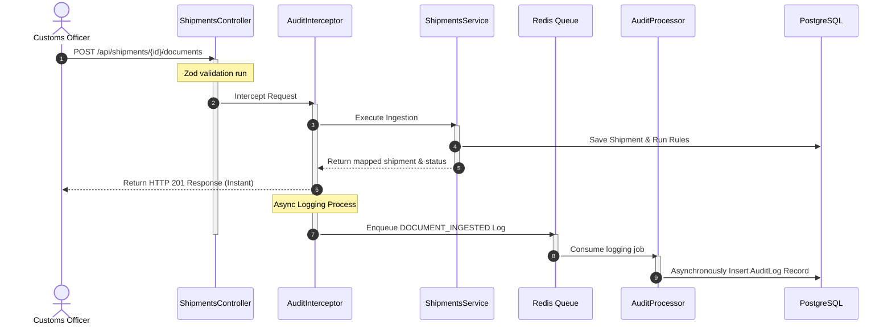
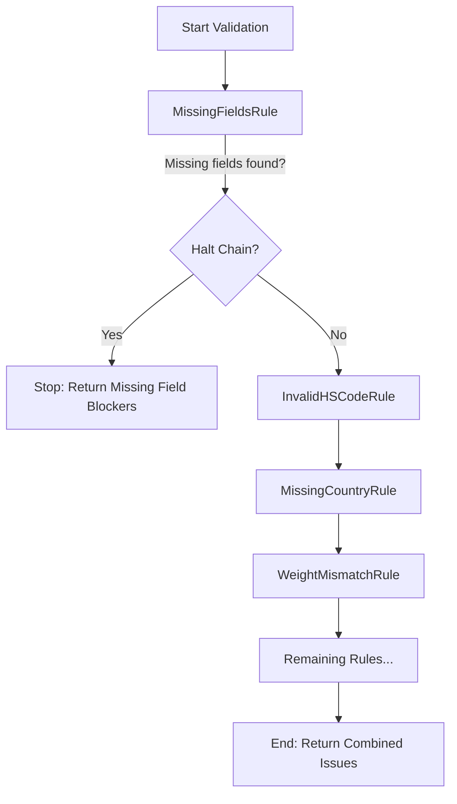

# Safiri AI Shipment Compliance Platform

A modern, high-performance logistics compliance system for validating shipment OCR data and ensuring cross-border customs readiness. The backend is built with **NestJS**, **Prisma**, **PostgreSQL**, and **BullMQ/Redis**, and the frontend is built with **React (Vite)** and **TailwindCSS**.

---

## 💻 Technology Stack Rationale

Choosing the right tools is about balancing developer velocity, maintainability, and architectural scalability. Here is why this stack was selected:

- **NestJS:** Chosen for its robust, highly opinionated architecture. It provides out-of-the-box support for Dependency Injection, Aspect-Oriented Programming (via Interceptors and Guards), and strict TypeScript integration, making it ideal for scalable, enterprise-grade backend systems.
- **React (with Vite):** The industry standard for declarative, component-based UIs. Vite was selected for its vastly superior hot-module replacement (HMR) speeds and optimized production builds, offering a world-class developer experience.
- **PostgreSQL:** A highly reliable, ACID-compliant relational database. Given the strictly typed nature of logistics data (e.g., customs rules, shipment metadata), a relational schema with foreign key constraints ensures data integrity far better than a NoSQL approach.

---

## 🏗️ System Architecture & Design Patterns

The platform implements clean-code principles and robust software design patterns to achieve separation of concerns, high testability, and asynchronous scaling:

### 1. Request Workflow & Event Decoupling (AOP + Producer-Consumer)
We decouple HTTP handler executions from long-running database insertions and logging routines using **Aspect-Oriented Programming (AOP)** and **Message Queues**:



* **Aspect-Oriented Programming (AOP):** A custom decorator `@AuditLog` and a global NestJS `AuditInterceptor` capture events like `DOCUMENT_INGESTED`, `FIELD_UPDATED`, and `READINESS_REPORT_GENERATED` declaratively at the controller boundary. This removes all logging boilerplate from the service layer.
* **Producer-Consumer (BullMQ/Redis):** Log enqueuing is asynchronous. If the PostgreSQL database experiences a write peak, HTTP endpoints are completely unaffected, as logs are queued in memory via Redis first.

---

### 2. Validation Pipeline (Chain of Responsibility)
Rather than executing all compliance checks in a standard flat array loop, the engine chains rules together. 



* **Bypassing Downstream Noise:** The `MissingFieldsRule` acts as the head of the chain. If crucial database fields (like `exporter`, `grossWeightKg`, or `hsCode`) are completely missing, it halts the execution chain immediately. This prevents secondary rules (like format parsing or value threshold checking) from running on blank values, keeping the compliance report focused and clean.
* **Aggregated Warnings:** If structural fields are complete, subsequent checks do *not* halt. For example, a shipment with both a format error in the HS code and a weight mismatch will report both issues simultaneously.

---

## 🌟 Key Features

The platform goes beyond simple CRUD operations, providing a resilient, enterprise-grade data processing pipeline:

- **🛡️ Pluggable Validation Engine**
  - A sophisticated rules engine implementing the **Chain of Responsibility** pattern.
  - Processes over 10 complex domain-specific customs rules (e.g., ISO 6346 container validation, ISPM-15 wood packaging checks, WCO HS code validation, and invoice anomaly detection).
  - Intelligently short-circuits execution on critical missing fields to eliminate redundant, noisy errors, while continuing on non-blocking checks to comprehensively aggregate all compliance issues in a single pass.

- **🔀 Resilient OCR Data Ingestion Layer**
  - Real-world OCR data is messy and unstructured. The ingestion mapping layer dynamically parses and normalizes semi-structured JSON payloads with unpredictable key variations (e.g., handling variants like `weight_gross`, `exporter_details`, etc.).
  - Safely maps untrusted external payloads into a strictly typed, normalized relational database schema (Prisma/PostgreSQL).

- **⚡ Event-Driven Audit Trail (AOP & Message Queues)**
  - Built for high concurrency. Uses **Aspect-Oriented Programming (Interceptors)** to automatically hook into HTTP requests and emit lifecycle events (e.g., `DOCUMENT_INGESTED`).
  - Events are fired asynchronously into a **BullMQ/Redis queue**, where background workers hydrate the database Audit Trail. This guarantees that frontend HTTP response times are never penalized by heavy database I/O during audit logging peaks.

- **🎨 High-Performance React Dashboard**
  - A sleek, polished React (Vite) interface built with TailwindCSS.
  - Features custom declarative state components (e.g., the `<Show>` wrapper) to eliminate complex ternary rendering trees and ensure extremely clean component logic.
  - Includes a specialized tabbed split-view that allows customs officers to compare the raw OCR JSON side-by-side against the engine's structured compliance report, alongside a full chronological event timeline.

---

## 🌍 Public Data Sources (Reference Data)

As recommended for a strong submission, the validation engine leverages public reference data to validate incoming shipments:
- **ISO 3166-1 (Countries) & ISO 4217 (Currencies):** A static seed file of ISO alpha-2 country codes and currencies is used to validate the `country_of_origin` and `currency` fields.
- **WCO Harmonized System (HS Codes):** The rules engine validates the structural format of the WCO 6-digit prefix against expected numeric patterns.
*Note: For this take-home, reference datasets are cached locally in the PostgreSQL database via the Prisma seed script (`prisma db seed`) rather than fetched live. This ensures fast, reliable testing without external network dependencies.*

---

## 🔌 API Design

The backend exposes a clean RESTful interface. Full interactive documentation is available via **Swagger UI** at `http://localhost:3000/api` once the server is running.

**Core Endpoints:**
- `POST /api/shipments` - Creates a new draft shipment record.
- `GET /api/shipments/:id` - Retrieves a specific shipment and its current status.
- `POST /api/shipments/:id/documents` - Ingests mock OCR data and maps it to the shipment.
- `POST /api/shipments/:id/validate` - Runs the compliance validation engine.
- `GET /api/shipments/:id/issues` - Retrieves active validation issues and warnings.
- `GET /api/shipments/:id/readiness-report` - Retrieves the compliance readiness report.
- `GET /api/shipments/:id/audit-log` - Retrieves the chronological event timeline for the shipment.

**Example Request (Data Ingestion):**
```bash
curl -X POST http://localhost:3000/api/shipments/123e4567-e89b-12d3-a456-426614174000/documents \
  -H "Content-Type: application/json" \
  -d '{
    "shipment_reference": "SAF-IMP-2026-0007",
    "exporter": "BlueRiver Manufacturing Ltd",
    "hs_code": "8413.70",
    "gross_weight_kg": 12750,
    "net_weight_kg": 12100
  }'
```

---

## 🛠️ Prerequisites
Before running, make sure you have:
- **Node.js** (v18+)
- **npm** (v9+)
- **Docker & Docker Compose**

---

## 🏁 Installation & Setup

### 1. Start Infrastructure (PostgreSQL & Redis)
To avoid local conflicts with native Postgres servers, the Docker Postgres container is mapped to port **`5433`**, and Redis is mapped to port **`6379`**.

Run the following in the root folder:
```bash
docker-compose up -d
```

### 2. Configure & Boot Backend
Navigate to the `backend` folder and run the migration and seeding scripts:
```bash
cd backend
npm install

# Push Prisma schemas and seed reference tables (ISO Countries/Currencies)
npx prisma generate
npx prisma db push
npx prisma db seed

# Run the dev server
npm run start:dev
```
* **API Documentation:** Interactive Swagger interface is available at [http://localhost:3000/api](http://localhost:3000/api)
* **Configuration:** Decoupled config properties (like Database URL, Redis Port, and Server Port) are defined in [config.ts](file:///c:/Users/kmsadmin/Desktop/Test/safiri/backend/src/config.ts) and can be overwritten in `backend/.env`.

### 3. Boot Frontend
Navigate to the `frontend` folder and run the Vite dashboard:
```bash
cd ../frontend
npm install
npm run dev
```
* **Vite Web Dashboard:** Running at [http://localhost:5173](http://localhost:5173)

---

## 🧪 Testing

The backend includes Jest tests verifying validation engine behaviors and individual rule constraints. Run them inside the `backend` folder:
```bash
npm run test
```

To run tests in watch mode:
```bash
npm run test:watch
```

---

## ⚖️ Assumptions & Trade-offs

To deliver a focused, production-ready module within the requested 6-10 hour timebox, the following decisions were made:
- **No Real OCR Integration:** Per the prompt, real OCR was deemed out of scope. The ingestion endpoint accepts simulated JSON OCR payloads.
- **Database Choice (PostgreSQL):** While NoSQL is sometimes used for unstructured document ingestion, PostgreSQL was chosen because customs compliance relies heavily on structured reporting and reference data.
- **Standalone Reference Tables vs Hardcoded Lists:** We dropped direct database-level foreign key constraints between `Shipment` and `IsoCountry`/`IsoCurrency` to enable ingestion resilience (saving malformed draft inputs). However, these tables are **not redundant**. They serve as our master reference data. Validation rules query these tables dynamically (e.g. querying `IsoCountry` to see if country code `'XX'` exists). Storing this in the database rather than hardcoding arrays in the codebase keeps reference lists maintainable and allows metadata updates (such as country risk profiles or tax rates) without redeploying the backend.
- **Sync Validation vs Async Auditing:** The core validation engine runs synchronously so the API can return immediate feedback (HTTP 201 with the readiness report). However, logging and audit trails were pushed to an asynchronous Redis queue to prevent database write locks and keep the API extremely fast.
- **Authentication/Authorization:** Left out of scope to focus entirely on the core domain logic, robust data modeling, and the compliance engine.

---

## 🤖 AI-Assisted Development

As part of the development process, AI coding tools were utilized responsibly to accelerate delivery while maintaining strict engineering standards. Blindly generating code that cannot be explained is a serious red flag; therefore, all AI assistance was heavily curated.

- **Tools Used:** AI coding assistants (Gemini).
- **AI-Assisted Parts:** 
  - Scaffolding the initial project structure and boilerplate.
  - Planning the execution process phase by phase.
  - Validating the implementation against the core requirements.
  - Refactoring code segments for better readability and maintainability.
- **Review and Correction Process:** 
  - All AI-generated output was thoroughly reviewed, manually tested, and validated against the original requirements. Every line of code was vetted to ensure it aligned with the intended architectural vision and standard best practices.
- **Disagreements & Rejections (Where AI was overridden):**
  - **Coupled Logging:** The AI initially suggested tightly coupling the logging and tracing directly within the service layer. I disagreed and rejected this in favor of a decoupled approach using **Aspect-Oriented Programming (Interceptors)** and a **Message Queue (BullMQ/Redis)**. This ensures that HTTP endpoints remain fast and unaffected by database write peaks.
  - **Validation Noise:** The AI's initial validation implementation ran all rules concurrently and returned every single error at once. This created an annoying and noisy developer/user experience (e.g., returning a "missing weight" error alongside an "invalid weight format" rule exception). I rejected this and refactored the engine into a **Chain of Responsibility**, where missing core structural fields halt the chain and prevent secondary, redundant rules from executing.
  - **Direct PrismaClient Usage:** The AI attempted to use `PrismaClient` directly throughout the service functions. I refactored this to use a dedicated `DbService` injected via NestJS Dependency Injection. This drastically improves readability, enhances testability, and centralizes database connection management.
  - **Relational Constraints vs Ingestion Resilience (Database-level foreign keys):** The AI proposed hard database-level foreign keys linking the `Shipment` model directly to the `IsoCountry` and `IsoCurrency` reference tables. I rejected this design choice. If the OCR ingestion parser maps a raw payload containing a typo or invalid code (like `'XX'`), the database insertion would crash with a PostgreSQL foreign key constraint violation (Prisma P2003 error), blocking the document from being imported at all. I removed the database-level constraints on `countryCode` and `currencyCode`, keeping `IsoCountry` and `IsoCurrency` as standalone reference tables that the validation rules query dynamically. This enables ingestion resilience (saving bad data so it can be corrected in-app) while still enforcing strict compliance checks.
