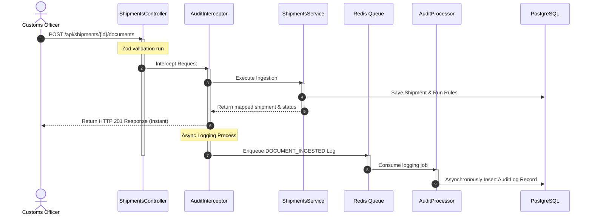
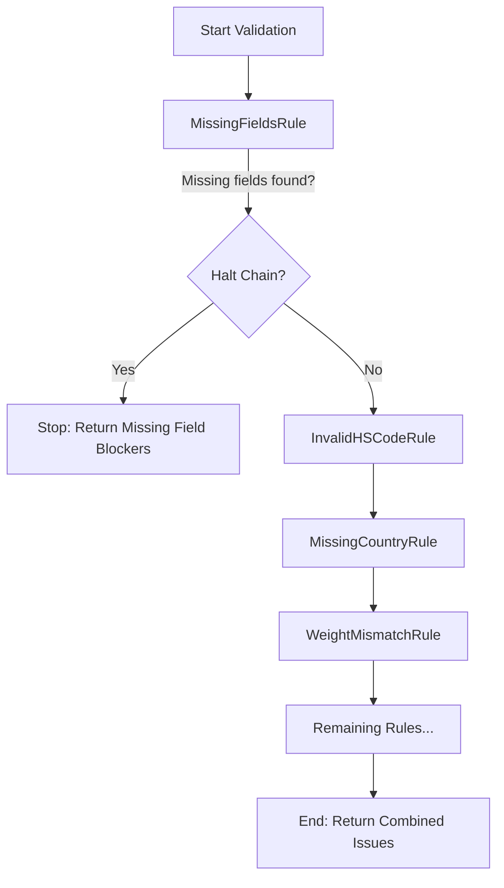

# Safiri AI Shipment Compliance Platform

A modern, high-performance logistics compliance system for validating shipment OCR data and ensuring cross-border customs readiness. The backend is built with **NestJS**, **Prisma**, **PostgreSQL**, and **BullMQ/Redis**, and the frontend is built with **React (Vite)** and **TailwindCSS**.

---

## 💻 Technology Stack Rationale

The technology stack was chosen with a primary focus on architectural scalability, long-term maintainability, and rapid iteration. Here is the decision-making rationale:

- **NestJS (Backend):** Selected for its modular, highly opinionated architecture that enforces a clean separation of concerns. By leveraging its out-of-the-box Dependency Injection and Aspect-Oriented Programming (AOP), we can easily decouple heavy operations (like auditing or external integrations) from core business logic. This prevents code coupling and ensures the backend can seamlessly scale horizontally as domain complexity grows.
- **React + Vite + Tailwind + Shadcn (Frontend):** React and Vite provide an extremely fast, component-based foundation with optimized production builds. To maximize developer velocity, **Tailwind CSS** and **Shadcn UI** were integrated because they make it incredibly easy and fast to build complex, accessible, and consistent user interfaces. This combination allows for rapid feature delivery and a scalable design system without the overhead of maintaining custom CSS files.
- **PostgreSQL (Database):** Given the strictly typed, interrelated nature of logistics data (e.g., customs rules, shipment metadata), a relational schema was essential. PostgreSQL ensures data integrity through foreign key constraints and ACID compliance, which scales significantly better for complex transactional workloads and analytical queries than a NoSQL approach.

---

## 🏗️ System Architecture & Design Patterns

When designing the core architecture, I focused heavily on preventing API bottlenecks and ensuring the system remains testable and scalable under load. Here are the key structural decisions:

### 1. Request Workflow & Event Decoupling (AOP + Producer-Consumer)
One of the biggest risks in a compliance platform is the API choking on heavy audit-logging database writes. To solve this, I intentionally decoupled the HTTP request lifecycle from long-running logging routines using **Aspect-Oriented Programming (AOP)** and **Message Queues**:



* **Aspect-Oriented Programming (AOP):** A custom decorator `@AuditLog` and a global NestJS `AuditInterceptor` capture events like `DOCUMENT_INGESTED`, `FIELD_UPDATED`, and `READINESS_REPORT_GENERATED` declaratively at the controller boundary. This removes all logging boilerplate from the service layer.
* **Producer-Consumer (BullMQ/Redis):** Log enqueuing is asynchronous. If the PostgreSQL database experiences a write peak, HTTP endpoints are completely unaffected, as logs are queued in memory via Redis first.

---

### 2. Validation Pipeline (Chain of Responsibility)
I initially considered running all validation rules concurrently in a flat array, but realized this creates a terrible user experience—flooding customs officers with redundant, noisy errors (e.g., throwing an "invalid format" error when a field is simply missing). To solve this, I implemented a **Chain of Responsibility** pattern: 



* **Bypassing Downstream Noise:** I designed the `MissingFieldsRule` to act as a gatekeeper at the head of the chain. If crucial structural fields (like `exporter` or `hsCode`) are missing, it halts execution immediately. This deliberate short-circuiting keeps the compliance report focused and actionable instead of overwhelming the user.
* **Aggregated Warnings:** Conversely, if the core fields exist, the engine shifts behavior and aggregates issues without halting. A shipment with both an HS code format error and a weight mismatch will report both issues simultaneously, giving officers a complete picture in one pass.

---

## 🌟 Key Features

The platform goes beyond simple CRUD operations, providing a resilient, enterprise-grade data processing pipeline:

- **🛡️ Pluggable Validation Engine**
  - A sophisticated rules engine implementing the **Chain of Responsibility** pattern.
  - Processes over 10 complex domain-specific customs rules (e.g., ISO 6346 container validation, ISPM-15 wood packaging checks, WCO HS code validation, and invoice anomaly detection).
  - Intelligently short-circuits execution on critical missing fields to eliminate redundant, noisy errors, while continuing on non-blocking checks to comprehensively aggregate all compliance issues in a single pass.

- **🔀 Defensive OCR Data Ingestion Layer**
  - Knowing that real-world OCR data is messy and unpredictable, I built the ingestion layer to act as a defensive buffer. It dynamically parses and normalizes semi-structured JSON payloads, seamlessly handling edge-case key variations (e.g., `weight_gross` vs `grossWeightKg`).
  - This ensures we safely map untrusted external payloads into our strictly typed relational database without crashing the system.

- **⚡ Event-Driven Audit Trail (AOP & Message Queues)**
  - Built for high concurrency. Uses **Aspect-Oriented Programming (Interceptors)** to automatically hook into HTTP requests and emit lifecycle events (e.g., `DOCUMENT_INGESTED`).
  - Events are fired asynchronously into a **BullMQ/Redis queue**, where background workers hydrate the database Audit Trail. This guarantees that frontend HTTP response times are never penalized by heavy database I/O during audit logging peaks.

- **🎨 High-Performance React Dashboard**
  - I designed a sleek, polished React (Vite) interface built with TailwindCSS to optimize the end-user experience.
  - To keep the frontend codebase maintainable, I introduced custom declarative state components (like a `<Show>` wrapper) that completely eliminate messy ternary rendering trees.
  - Understanding that customs officers need context to make decisions, I built a specialized tabbed split-view. This allows them to instantly compare the raw OCR JSON side-by-side against the engine's structured compliance report and chronological audit timeline.

---

## 🌍 Public Data Sources (Reference Data)

As recommended for a strong submission, the validation engine leverages public reference data to validate incoming shipments:
- **ISO 3166-1 (Countries) & ISO 4217 (Currencies):** A static seed file of ISO alpha-2 country codes and currencies is used to validate the `country_of_origin` and `currency` fields.
- **WCO Harmonized System (HS Codes):** The rules engine validates the structural format of the WCO 6-digit prefix against expected numeric patterns.
*Note: For this take-home, reference datasets are cached locally in the PostgreSQL database via the Prisma seed script (`prisma db seed`) rather than fetched live. This ensures fast, reliable testing without external network dependencies.*

---

## 🔌 API Design

The backend exposes a clean RESTful interface. Full interactive documentation is available via **Swagger UI** at `http://localhost:3000/api` once the server is running.

**Core Endpoints:**
- `POST /api/shipments` - Creates a new draft shipment record.
- `GET /api/shipments/:id` - Retrieves a specific shipment and its current status.
- `POST /api/shipments/:id/documents` - Ingests mock OCR data and maps it to the shipment.
- `POST /api/shipments/:id/validate` - Runs the compliance validation engine.
- `GET /api/shipments/:id/issues` - Retrieves active validation issues and warnings.
- `GET /api/shipments/:id/readiness-report` - Retrieves the compliance readiness report.
- `GET /api/shipments/:id/audit-log` - Retrieves the chronological event timeline for the shipment.

---

## 🛠️ Prerequisites
Before running, make sure you have:
- **Node.js** (v18+)
- **npm** (v9+)
- **Docker & Docker Compose**

---

## 🏁 Installation & Setup

### 1. Start Infrastructure (PostgreSQL & Redis)
To avoid local conflicts with native Postgres servers, the Docker Postgres container is mapped to port **`5433`**, and Redis is mapped to port **`6379`**.

Run the following in the root folder:
```bash
docker-compose up -d
```

### 2. Configure & Boot Backend
Navigate to the `backend` folder and run the migration and seeding scripts:
```bash
cd backend
npm install

# Push Prisma schemas and seed reference tables (ISO Countries/Currencies)
npx prisma generate
npx prisma db push
npx prisma db seed

# Run the dev server
npm run start:dev
```
* **API Documentation:** Interactive Swagger interface is available at [http://localhost:3000/api](http://localhost:3000/api)
* **Configuration:** Decoupled config properties (like Database URL, Redis Port, and Server Port) are defined in [config.ts](file:///c:/Users/kmsadmin/Desktop/Test/safiri/backend/src/config.ts) and can be overwritten in `backend/.env`.

### 3. Boot Frontend
Navigate to the `frontend` folder and run the Vite dashboard:
```bash
cd ../frontend
npm install
npm run dev
```
* **Vite Web Dashboard:** Running at [http://localhost:5173](http://localhost:5173)

---

## 🧪 Testing

The backend includes Jest tests verifying validation engine behaviors and individual rule constraints. Run them inside the `backend` folder:
```bash
npm run test
```

To run tests in watch mode:
```bash
npm run test:watch
```

---

## ⚖️ Assumptions & Trade-offs

To deliver a focused, production-ready module within the requested 6-10 hour timebox, the following decisions were made:
- **No Real OCR Integration:** Per the prompt, real OCR was deemed out of scope. The ingestion endpoint accepts simulated JSON OCR payloads.
- **Database Choice (PostgreSQL over NoSQL):** While I could have used MongoDB to blindly dump unstructured OCR JSON, I actively chose PostgreSQL. Customs compliance fundamentally relies on structured reporting, relational references, and strict data integrity—areas where Postgres excels.
- **Ingestion Resilience vs. Strict Foreign Keys:** I made a deliberate trade-off to drop direct database-level foreign key constraints between the `Shipment` and `IsoCountry`/`IsoCurrency` reference tables. If an OCR payload contains a typo (like country `'XX'`), a strict foreign key would reject the entire document. By querying these reference tables at the validation layer instead of the schema layer, the system gracefully saves the malformed draft so an officer can correct it in the UI.
- **Sync Validation vs Async Auditing:** I engineered the core validation rules to run synchronously so the API instantly returns the readiness report to the user. However, I pushed all audit logging to an asynchronous Redis queue. This prevents heavy database write locks from slowing down the primary user workflow.
- **Authentication/Authorization:** I left this out of scope to focus entirely on engineering a robust, high-quality data processing pipeline and compliance engine within the timebox.

---

## 🤖 AI-Assisted Development

As part of the development process, AI coding tools were utilized responsibly to accelerate delivery while maintaining strict engineering standards. Blindly generating code that cannot be explained is a serious red flag; therefore, all AI assistance was heavily curated.

- **Tools Used:** AI coding assistants (Gemini).
- **AI-Assisted Parts:** 
  - Scaffolding the initial project structure and boilerplate.
  - Planning the execution process phase by phase.
  - Validating the implementation against the core requirements.
  - Refactoring code segments for better readability and maintainability.
- **Review and Correction Process:** 
  - All AI-generated output was thoroughly reviewed, manually tested, and validated against the original requirements. Every line of code was vetted to ensure it aligned with the intended architectural vision and standard best practices.
- **Disagreements & Rejections (Where AI was overridden):**
  - **Coupled Logging:** The AI initially suggested tightly coupling the logging and tracing directly within the service layer. I disagreed and rejected this in favor of a decoupled approach using **Aspect-Oriented Programming (Interceptors)** and a **Message Queue (BullMQ/Redis)**. This ensures that HTTP endpoints remain fast and unaffected by database write peaks.
  - **Validation Noise:** The AI's initial validation implementation ran all rules concurrently and returned every single error at once. This created an annoying and noisy developer/user experience (e.g., returning a "missing weight" error alongside an "invalid weight format" rule exception). I rejected this and refactored the engine into a **Chain of Responsibility**, where missing core structural fields halt the chain and prevent secondary, redundant rules from executing.
  - **Direct PrismaClient Usage:** The AI attempted to use `PrismaClient` directly throughout the service functions. I refactored this to use a dedicated `DbService` injected via NestJS Dependency Injection. This drastically improves readability, enhances testability, and centralizes database connection management.
  - **Relational Constraints vs Ingestion Resilience (Database-level foreign keys):** The AI proposed hard database-level foreign keys linking the `Shipment` model directly to the `IsoCountry` and `IsoCurrency` reference tables. I rejected this design choice. If the OCR ingestion parser maps a raw payload containing a typo or invalid code (like `'XX'`), the database insertion would crash with a PostgreSQL foreign key constraint violation (Prisma P2003 error), blocking the document from being imported at all. I removed the database-level constraints on `countryCode` and `currencyCode`, keeping `IsoCountry` and `IsoCurrency` as standalone reference tables that the validation rules query dynamically. This enables ingestion resilience (saving bad data so it can be corrected in-app) while still enforcing strict compliance checks.
