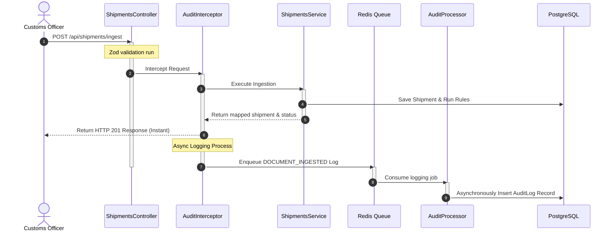
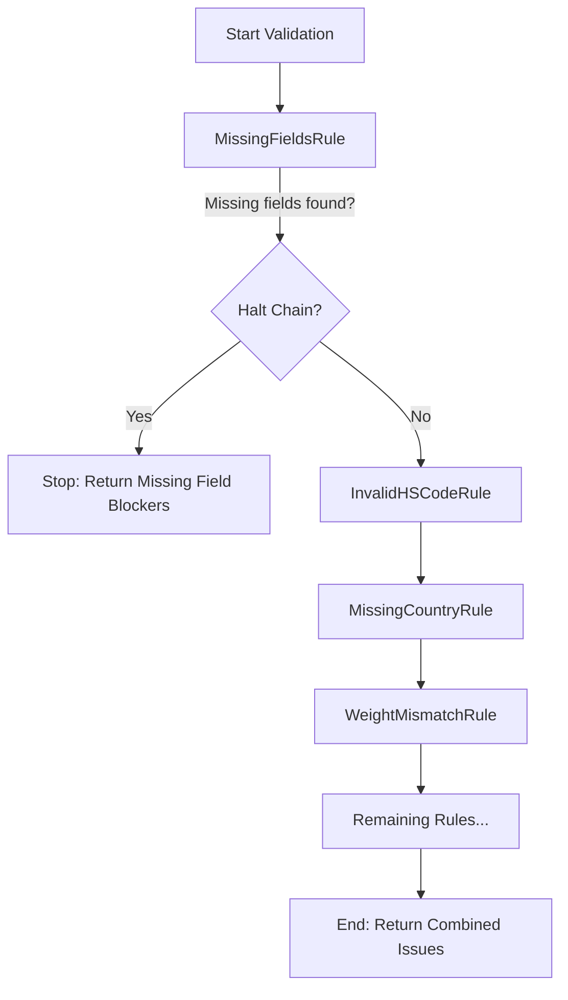

# Safiri AI Shipment Compliance Platform

A modern, high-performance logistics compliance system for validating shipment OCR data and ensuring cross-border customs readiness. The backend is built with **NestJS**, **Prisma**, **PostgreSQL**, and **BullMQ/Redis**, and the frontend is built with **React (Vite)** and **TailwindCSS**.

---

## 🏗️ System Architecture & Design Patterns

The platform implements clean-code principles and robust software design patterns to achieve separation of concerns, high testability, and asynchronous scaling:

### 1. Request Workflow & Event Decoupling (AOP + Producer-Consumer)
We decouple HTTP handler executions from long-running database insertions and logging routines using **Aspect-Oriented Programming (AOP)** and **Message Queues**:



* **Aspect-Oriented Programming (AOP):** A custom decorator `@AuditLog` and a global NestJS `AuditInterceptor` capture events like `DOCUMENT_INGESTED`, `FIELD_UPDATED`, and `READINESS_REPORT_GENERATED` declaratively at the controller boundary. This removes all logging boilerplate from the service layer.
* **Producer-Consumer (BullMQ/Redis):** Log enqueuing is asynchronous. If the PostgreSQL database experiences a write peak, HTTP endpoints are completely unaffected, as logs are queued in memory via Redis first.

---

### 2. Validation Pipeline (Chain of Responsibility)
Rather than executing all compliance checks in a standard flat array loop, the engine chains rules together. 



* **Bypassing Downstream Noise:** The `MissingFieldsRule` acts as the head of the chain. If crucial database fields (like `exporter`, `grossWeightKg`, or `hsCode`) are completely missing, it halts the execution chain immediately. This prevents secondary rules (like format parsing or value threshold checking) from running on blank values, keeping the compliance report focused and clean.
* **Aggregated Warnings:** If structural fields are complete, subsequent checks do *not* halt. For example, a shipment with both a format error in the HS code and a weight mismatch will report both issues simultaneously.

---

## 🌟 Key Features
- **Extensible OCR Ingestion Mapper:** Dynamically scans various semi-structured JSON key variations (`exporter_details`, `invoice_no`, `weight_gross`, etc.) and maps them to a strictly-typed database schema.
- **10 Core Validation Rules:**
  - `MissingFieldsRule`: Checks for mandatory fields.
  - `InvalidHSCodeRule`: Validates WCO digit format.
  - `MissingCountryRule`: Validates ISO 3166-1 alpha-2 origin codes against ref data.
  - `WeightMismatchRule`: Ensures gross weight >= net weight.
  - `MissingBillOfLadingRule` & `InvalidContainerRule`: Validates ISO 6346 container numbers.
  - `SuspiciousInvoiceRule`: Flags invoice values above $10M.
  - `WoodPackagingRule`: Validates ISPM-15 certification if wooden packaging is detected.
  - `ArrivalDateRule` & `DuplicateShipmentRule`: Restricts duplicate reference entries.
- **Compliance Dashboard:** Sleek, modern interface using declarative state components (using the custom `<Show>` wrapper), complete with a tabbed viewer for raw data verification and a chronological timeline audit trail.

---

## 🛠️ Prerequisites
Before running, make sure you have:
- **Node.js** (v18+)
- **npm** (v9+)
- **Docker & Docker Compose**

---

## 🏁 Installation & Setup

### 1. Start Infrastructure (PostgreSQL & Redis)
To avoid local conflicts with native Postgres servers, the Docker Postgres container is mapped to port **`5433`**, and Redis is mapped to port **`6379`**.

Run the following in the root folder:
```bash
docker-compose up -d
```

### 2. Configure & Boot Backend
Navigate to the `backend` folder and run the migration and seeding scripts:
```bash
cd backend
npm install

# Push Prisma schemas and seed reference tables (ISO Countries/Currencies)
npx prisma generate
npx prisma db push
npx prisma db seed

# Run the dev server
npm run start:dev
```
* **API Documentation:** Interactive Swagger interface is available at [http://localhost:3000/api](http://localhost:3000/api)
* **Configuration:** Decoupled config properties (like Database URL, Redis Port, and Server Port) are defined in [config.ts](file:///c:/Users/kmsadmin/Desktop/Test/safiri/backend/src/config.ts) and can be overwritten in `backend/.env`.

### 3. Boot Frontend
Navigate to the `frontend` folder and run the Vite dashboard:
```bash
cd ../frontend
npm install
npm run dev
```
* **Vite Web Dashboard:** Running at [http://localhost:5173](http://localhost:5173)

---

## 🧪 Testing

The backend includes Jest tests verifying validation engine behaviors and individual rule constraints. Run them inside the `backend` folder:
```bash
npm run test
```

To run tests in watch mode:
```bash
npm run test:watch
```
